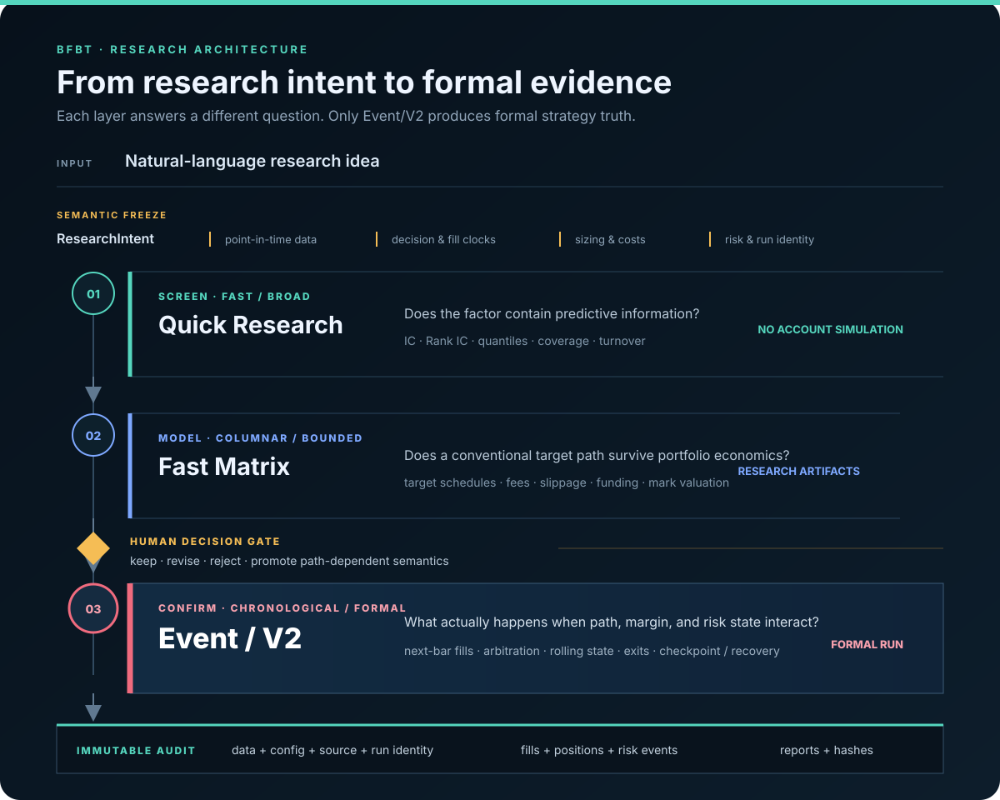
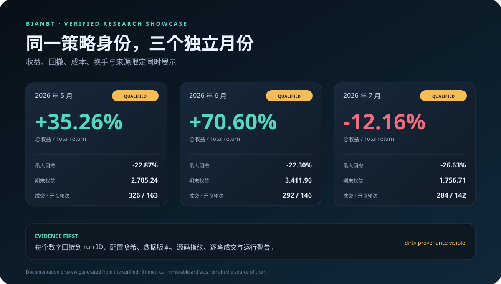

# BFBT

[](https://github.com/Montayang/bfbt/actions/workflows/tests.yml)

[](LICENSE)

**Binance Futures Backtesting Framework** — an offline research and backtesting system for
cross-sectional factors on Binance USDⓈ-M perpetual futures.

[中文说明](README.zh-CN.md) · [Documentation](docs/README.en.md) ·
[Showcase guide](showcase/README.md) · [Contributing](CONTRIBUTING.md)

> BFBT is an independent open-source research project. It is not affiliated with, endorsed by,
> sponsored by, or financially connected to Binance. It uses public historical market data only,
> contains no account client or live-order path, and does not provide investment advice.

## Why three research layers?



- **Quick Research** evaluates factor information without simulating an account: IC, Rank IC,
  quantile returns, coverage, and Rank turnover.
- **Fast Matrix** evaluates conventional cross-sectional portfolios quickly, including valuation,
  fees, slippage, funding, and turnover. Its outputs remain research results for human review.
- **Event Engine** performs the detailed formal backtest. It follows account, position, margin,
  fills, and risk state through time, including path-dependent exits and rolling margin.
- BFBT keeps exploratory research separate from formal simulation: the user selects promising
  research results, and strategies that depend on an exact event path move to the Event Engine.

## Verified offline Showcase

The repository includes an evidence-backed Agent/research showcase. It connects a natural-language
request, confirmed research assumptions, three independent monthly backtests, rolling opening-margin
paths, and trade-level evidence. Every displayed number traces back to a verified result.



On a prepared machine that contains the three recorded monthly runs:

```bash
.venv/bin/bfbt showcase prepare \
  --spec showcase/r5_t4_h2_rolling_202605_202607.json
```

Read-only preflight:

```bash
.venv/bin/bfbt doctor \
  --spec showcase/r5_t4_h2_rolling_202605_202607.json
```

Market data and completed backtest results are intentionally excluded from Git, so a fresh checkout
does not contain these three runs. The repository includes the preview and the code needed to verify
and present prepared results; see the [Showcase guide](showcase/README.md).

## Implemented capabilities

- Binance USD-M USDT-margined perpetuals with 1-minute trade/mark bars, funding, and contract
  metadata.
- Immutable raw and normalized Parquet storage, quality reports, a DuckDB catalog, and versioned
  dataset snapshots.
- Point-in-time universes, causal factor/label timing, preprocessing, IC/Rank IC, quantile returns,
  and turnover diagnostics.
- Built-in momentum, reversal, volatility, volume, active-buy, Amihud, EMA, sampled-mean-ratio, and
  registered GTJA191 factors.
- Fast Matrix portfolio research with funding and mark-price valuation, costs, checkpoints, and
  comparable research results.
- Event Engine next-bar execution, explicit fees/slippage/funding, incremental sizing, leverage and
  exposure limits, fixed/trailing exits, rolling margin, and deterministic event priority.
- Bounded-memory full-market execution, atomic checkpoints, failure recovery, and continuous-versus-
  resumed economic equivalence.
- Immutable success/failure artifacts, source and dependency fingerprints, plus complete trade,
  position-change, and risk-event audit navigation.
- A controlled natural-language research workflow for the included Showcase, with ambiguity checks,
  read-only diagnostics, and evidence-backed results. It is not yet a general no-code service.
- Automated offline verification on supported Python versions, covering research, execution,
  recovery, reports, and immutable evidence.

## Installation

BFBT requires Python 3.10 or newer.

```bash
python3 -m venv .venv
source .venv/bin/activate
python -m pip install --upgrade pip
python -m pip install -e ".[test]"
bfbt --help
bfbt doctor
```

Downloading real market history requires access to Binance public market-data services but no API
key. Start with the [beginner tutorial](docs/guides/beginner_tutorial.md), then use the
[user manual](docs/guides/user_manual.md) for complete configuration and troubleshooting.

## Reproducibility and auditability

- Every interval uses UTC left-closed/right-open semantics: `[start, end)`.
- Factor availability, Rank, decision, fill, risk, funding, and valuation clocks are explicit.
- Formal runs reject `latest`; they bind an exact dataset, resolved configuration, factor version,
  source state, and dependency environment.
- Successful and failed terminal artifacts are immutable. A revision receives a new alias and run
  ID instead of overwriting history.
- Display curves may be downsampled, but every fill, position-change timestamp, and risk event stays
  available in audit navigation.
- Path-dependent strategies use the Event Engine; Fast Matrix research results are never presented
  as completed formal backtests.

## Explicitly out of scope

- Exchange accounts, balances, credentials, private order streams, and live order placement.
- Full exchange liquidation tiers, ADL, order-book queueing, and tick-level fill simulation.
- Automatic Agent selection of Fast Matrix candidates.
- Direct execution of arbitrary LLM-generated Python, shell, or factor expressions.
- A general natural-language/no-code research control plane. The current Showcase implements only
  a bounded, verifiable result-query workflow.

## Human-readable output languages

Human-facing generated HTML is published as separate English and Simplified Chinese documents.
Machine-readable JSON, Parquet, manifests, hashes, and metric keys remain language-neutral and are
not duplicated. Compatibility entry pages default to English and link to the Chinese counterpart.

## Start here

- [Beginner tutorial](docs/guides/beginner_tutorial.md): prepare public data and produce a first
  backtest report.
- [User manual](docs/guides/user_manual.md): commands, configuration, outputs, and troubleshooting.
- [Custom factor tutorial](docs/guides/custom_factor_tutorial.md): add and research a new
  cross-sectional factor.
- [Showcase guide](showcase/README.md): inspect the included evidence-backed demonstration.
- [Documentation map](docs/README.en.md): architecture, data contracts, research records, and
  contributor references.

## License, contribution, and security

BFBT is released under the [MIT License](LICENSE). Development guidance is in
[`CONTRIBUTING.md`](CONTRIBUTING.md), the security boundary and private reporting route are in
[`SECURITY.md`](SECURITY.md), and behavior-level changes are tracked in
[`CHANGELOG.md`](CHANGELOG.md).
