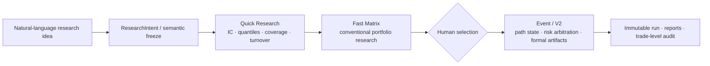

# BFBT

[](https://github.com/Montayang/bfbt/actions/workflows/tests.yml)

[](LICENSE)

**Binance Futures Backtesting Framework** — an offline research and backtesting system for
cross-sectional factors on Binance USDⓈ-M perpetual futures.

[中文说明](README.zh-CN.md) · [Documentation](docs/README.en.md) ·
[Showcase guide](showcase/README.md) · [Contributing](CONTRIBUTING.md)

> BFBT is an independent open-source research project. It is not affiliated with, endorsed by,
> sponsored by, or financially connected to Binance. It uses public historical market data only,
> contains no account client or live-order path, and does not provide investment advice.

## Why three research layers?



- **Quick Research** evaluates factor information without simulating an account: IC, Rank IC,
  quantile returns, coverage, and Rank turnover.
- **Fast Matrix** evaluates conventional cross-sectional target schedules within an explicit
  linear-economics capability boundary. Its outputs are research artifacts, not formal strategy
  truth.
- **Event/V2** maintains chronological account, position, margin, and risk state. It handles
  path-dependent exits, event arbitration, rolling margin, checkpoint/recovery, and immutable
  formal runs.
- Unsupported Fast Matrix semantics fail closed or are explicitly promoted to Event/V2. V1 is
  retained for compatibility only.

## Verified offline Showcase

The repository includes a bounded Agent/research showcase. It connects a natural-language request,
frozen economic semantics, three independent monthly Event runs, rolling opening-margin paths, and
artifact-level evidence. Every displayed number is derived from a verified immutable run.


On a machine that already contains the curated local H2 artifacts:

```bash
.venv/bin/bfbt showcase prepare \
  --spec showcase/r5_t4_h2_rolling_202605_202607.json
```

Read-only preflight:

```bash
.venv/bin/bfbt doctor \
  --spec showcase/r5_t4_h2_rolling_202605_202607.json
```

Market data and formal run artifacts are intentionally excluded from Git. A fresh checkout does
not contain the three real runs. The versioned contract, renderer, preview, and deterministic
offline fixture tests are included; see the [Showcase guide](showcase/README.md).

## Implemented capabilities

- Binance USD-M USDT-margined perpetuals with 1-minute trade/mark bars, funding, and contract
  metadata.
- Immutable raw and normalized Parquet storage, quality reports, a DuckDB catalog, and exact
  `DatasetSnapshot` identities.
- Point-in-time universes, causal factor/label timing, preprocessing, IC/Rank IC, quantile returns,
  and turnover diagnostics.
- Built-in momentum, reversal, volatility, volume, active-buy, Amihud, EMA, sampled-mean-ratio, and
  registered GTJA191 factors.
- Fast Matrix target-schedule economics with funding/mark valuation, chunked checkpoints, research
  artifacts, and explicit Event promotion.
- Event/V2 next-bar execution, explicit fees/slippage/funding, incremental sizing, leverage and
  exposure limits, fixed/trailing exits, rolling margin, and deterministic event priority.
- Bounded-memory full-market execution, atomic checkpoints, failure recovery, and continuous-versus-
  resumed economic equivalence.
- Immutable success/failure artifacts, source and dependency fingerprints, plus complete trade,
  position-change, and risk-event audit navigation.
- A controlled Agent-facing `ResearchIntent`, ambiguity gate, action classes, read-only doctor, and
  verified Showcase evidence. This is a curated thin slice, not a general no-code Agent service.
- Public acceptance coverage through A40. The BFBT public-release candidate passes all 334 offline
  tests; exact environment and historical evidence are recorded in
  [`CURRENT_STATE.md`](docs/maintainer/CURRENT_STATE.md).

## Installation

BFBT requires Python 3.10 or newer.

```bash
python3 -m venv .venv
source .venv/bin/activate
python -m pip install --upgrade pip
python -m pip install -e ".[test]"
bfbt --help
bfbt doctor
```

Downloading real market history requires access to Binance public market-data services but no API
key. Start with the [beginner tutorial](docs/guides/beginner_tutorial.md), then use the
[user manual](docs/guides/user_manual.md) for complete configuration and troubleshooting.

## Correctness and identity boundaries

- Every interval uses UTC left-closed/right-open semantics: `[start, end)`.
- Factor availability, Rank, decision, fill, risk, funding, and valuation clocks are explicit.
- Formal runs reject `latest`; they bind an exact dataset, resolved configuration, factor version,
  source state, and dependency environment.
- Successful and failed terminal artifacts are immutable. A revision receives a new alias and run
  ID instead of overwriting history.
- Display curves may be downsampled, but every fill, position-change timestamp, and risk event stays
  available in audit navigation.
- Path-dependent strategies must use Event/V2; Fast Matrix results cannot be presented as formal
  Event confirmation.

## Explicitly out of scope

- Exchange accounts, balances, credentials, private order streams, and live order placement.
- Full exchange liquidation tiers, ADL, order-book queueing, and tick-level fill simulation.
- Automatic Agent selection of Fast Matrix candidates.
- Direct execution of arbitrary LLM-generated Python, shell, or factor expressions.
- A general natural-language/no-code research control plane. The current Showcase implements only
  a bounded, verifiable result-query workflow.

## Human-readable output languages

Human-facing generated HTML is published as separate English and Simplified Chinese documents.
Machine-readable JSON, Parquet, manifests, hashes, and metric keys remain language-neutral and are
not duplicated. Compatibility entry pages default to English and link to the Chinese counterpart.

## Project map

- [`docs/README.en.md`](docs/README.en.md): English documentation map; detailed engineering records
  link to their current Chinese originals where an English translation is not yet available.
- [`docs/maintainer/START_HERE.md`](docs/maintainer/START_HERE.md): maintenance and authorization
  entry point.
- [`docs/maintainer/SHOWCASE_PLAN.md`](docs/maintainer/SHOWCASE_PLAN.md): implemented showcase scope
  and acceptance boundary.
- [`docs/maintainer/AI_AGENT_READINESS.md`](docs/maintainer/AI_AGENT_READINESS.md): remaining gaps for
  the general natural-language research workflow.
- [`strategies/README.md`](strategies/README.md): stable strategy identities and formal run mappings.
- [`docs/design/architecture.md`](docs/design/architecture.md): modules and end-to-end data flow.
- [`docs/reference/data_contract.md`](docs/reference/data_contract.md): fact tables and artifact
  schemas.

## License, contribution, and security

BFBT is released under the [MIT License](LICENSE). Development guidance is in
[`CONTRIBUTING.md`](CONTRIBUTING.md), the security boundary and private reporting route are in
[`SECURITY.md`](SECURITY.md), and behavior-level changes are tracked in
[`CHANGELOG.md`](CHANGELOG.md).
