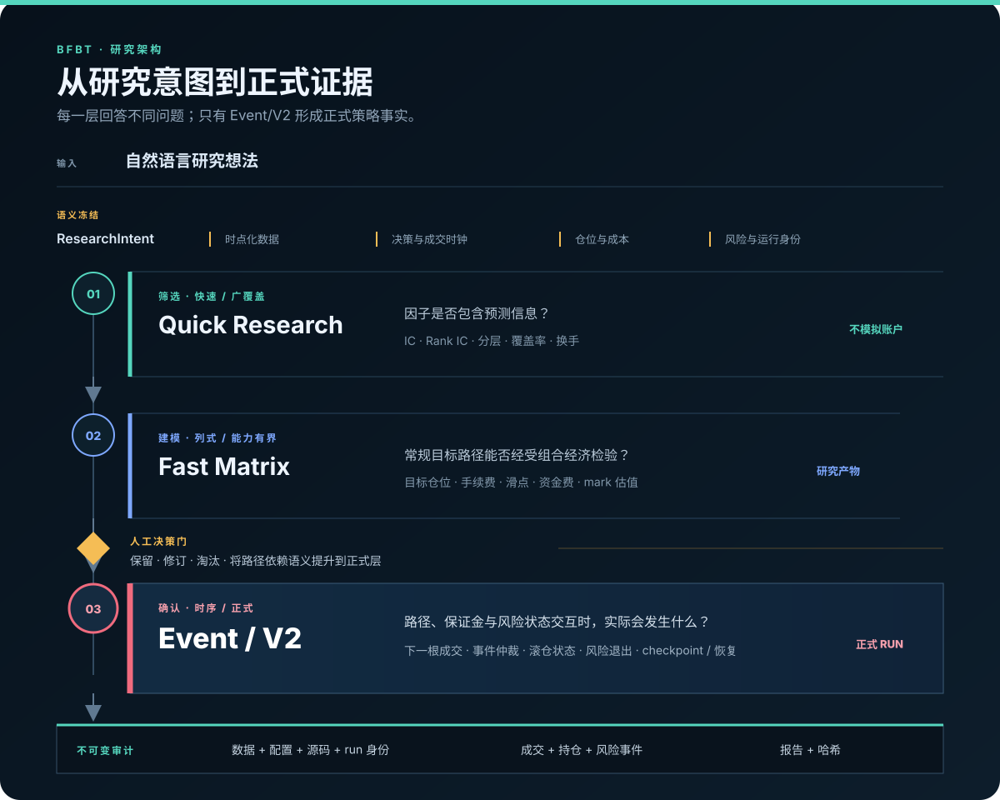

# BFBT

[](https://github.com/Montayang/bfbt/actions/workflows/tests.yml)

[](LICENSE)

**Binance Futures Backtesting Framework**——面向 Binance USDⓈ-M 永续合约截面因子研究的
离线研究与回测系统。

[English](README.md) · [文档导航](docs/README.md) · [Showcase 指南](showcase/README.md) ·
[贡献指南](CONTRIBUTING.zh-CN.md)

> BFBT 是独立的开源研究项目，与 Binance 不存在隶属、背书、赞助或任何利益关系。项目只
> 使用公开历史市场数据，不包含账户 Client 或实盘下单路径，也不构成投资建议。

BFBT 把快速因子诊断、常规组合研究和路径依赖的正式回测分层处理，并让数据、设置、成交和
报告可以相互追溯。

## 为什么分成三层



- **Quick Research** 不模拟账户，用于因子 IC、分层收益、覆盖率和 Rank turnover 诊断。
- **Fast Matrix** 快速评估常规截面组合，同时计算估值、手续费、滑点、资金费和换手；结果
  仍是供用户筛选的研究结果。
- **Event 引擎** 执行精细的正式回测，按时间追踪账户、仓位、保证金、成交和风险状态，支持
  路径依赖退出和滚仓保证金。
- BFBT 将探索性研究与正式模拟分开：用户从研究结果中选择候选，依赖精确事件路径的策略再
  交给 Event 引擎确认。

## Showcase

仓库包含一个有证据支撑的 Agent/研究展示入口。它把自然语言请求、已确认的研究口径、三个
独立月份的回测、滚仓保证金轨迹和逐笔证据连成一个离线页面；每个数字都能追溯到已验证结果。


在已经保存这三个月回测结果的机器上：

```bash
.venv/bin/bfbt showcase prepare \
  --spec showcase/r5_t4_h2_rolling_202605_202607.json
```

生成页面位于：

```text
data/backtest/showcases/r5-t4-h2-rolling-202605-202607-r01/index.html
```

默认 `index.html` 为英文入口；同目录还会生成显式英文 `index.en.html` 与独立简体中文
`index.zh-CN.html`。其他面向人的 HTML 报告也遵循相同语言合同，机器可读证据不复制。

只读检查，不生成页面：

```bash
.venv/bin/bfbt doctor \
  --spec showcase/r5_t4_h2_rolling_202605_202607.json
```

市场数据和完整回测结果按设计不提交 Git，因此全新下载的仓库不会自带这三份真实结果。仓库
包含预览，以及验证和展示已准备结果所需的代码；完整演示步骤见
[`showcase/README.md`](showcase/README.md)。

## 当前能力

- Binance USD-M、USDT 保证金、永续合约；1m trade/mark bars、funding 与合约元数据。
- 不可变原始数据、标准化 Parquet、质量报告、DuckDB Catalog 和版本化数据快照。
- 时点化合约池、无前视因子/标签、预处理、IC/Rank IC、分层收益和 turnover。
- 内建 momentum、reversal、波动率、成交量、主动买入、Amihud、EMA、采样均值比和已登记
  GTJA191 因子；精确清单由 `bfbt research list-factors` 输出。
- Fast Matrix 组合研究、资金费与标记价格估值、成本、checkpoint 和可比较的研究结果。
- Event 引擎下一根 K 线成交、显式手续费/滑点/资金费率、增量仓位、杠杆/敞口限制、固定与
  移动风险退出、滚仓保证金和统一事件优先级。
- 全市场分钟级 bounded-memory chunk、原子 checkpoint、失败恢复和连续/恢复经济等价。
- 不可变成功/失败 artifact、源码与依赖指纹、双语交互报告，以及完整成交、持仓变化和风险
  事件导航。
- Showcase 提供受控的自然语言研究工作流，包含歧义检查、只读诊断和可追溯结果；目前还不是
  通用无代码服务。
- 自动化离线验证覆盖研究、执行、恢复、报告和不可变证据，并在支持的 Python 版本上运行。

## 安装

需要 Python 3.10 或更高版本：

```bash
python3 -m venv .venv
source .venv/bin/activate
python -m pip install --upgrade pip
python -m pip install -e ".[test]"
bfbt --help
bfbt doctor
```

真实数据首次使用需要访问 Binance 公共市场数据服务，但不需要 API key。详细安装、数据准备
和第一份真实小样本回测见
[`beginner_tutorial.md`](docs/guides/beginner_tutorial.md)；完整配置与故障排查见
[`user_manual.md`](docs/guides/user_manual.md)。

## 可复现与可审计

- 所有时间区间采用 UTC 左闭右开 `[start, end)`；因子、Rank、决策、成交、风险、funding
  和估值拥有显式时钟。
- 正式运行拒绝 `latest`，必须固定数据集 ID/版本、完整配置、因子版本、源码和依赖环境。
- 成功和失败的终态 artifact 都不可变；修改策略或重跑使用新 alias/revision 和新 run ID。
- 曲线可以压缩展示点，但每笔成交、每次持仓变化和风险事件必须留在审计导航中。
- 路径依赖策略使用 Event 引擎；Fast Matrix 研究结果不会被包装成已经完成的正式回测。

## 明确不支持

- 实盘账户、余额、订单、API key 或 `.env` 访问。
- 交易所完整强平阶梯、ADL、订单簿排队和 tick 级成交。
- Agent 自动替用户选择 Fast Matrix 候选。
- 任意 LLM 生成 Python、shell 或因子表达式的直接执行。
- 当前 Showcase 的 ResearchIntent 是受控薄切片，不等于通用无代码 Agent 平台已经完成。

## 从这里开始

- [入门教程](docs/guides/beginner_tutorial.md)：准备公开数据并生成第一份回测报告。
- [用户手册](docs/guides/user_manual.md)：命令、配置、输出解读和故障排查。
- [自定义因子教程](docs/guides/custom_factor_tutorial.md)：添加并研究新的截面因子。
- [Showcase 指南](showcase/README.md)：查看仓库内可追溯的演示案例。
- [文档导航](docs/README.md)：架构、数据合同、研究记录和开发者资料。

## 参与和安全

开发约定见 [`CONTRIBUTING.md`](CONTRIBUTING.md)，安全边界与漏洞报告见
[`SECURITY.md`](SECURITY.md)，版本变化见 [`CHANGELOG.md`](CHANGELOG.md)。项目采用
[`MIT License`](LICENSE)。
