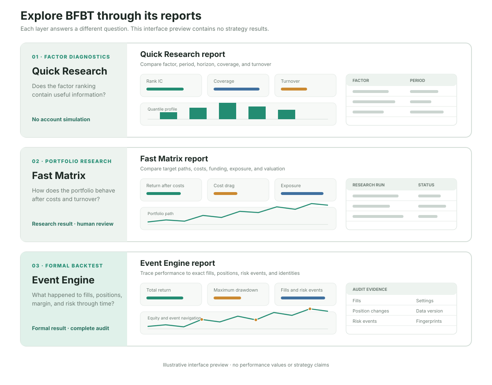

# Explore BFBT

[简体中文](README.zh-CN.md)

This is a self-guided tour for someone exploring BFBT from a fresh checkout. It is not a
presentation script. The main experience is the set of reports produced by BFBT's three research
layers: each layer answers a different question and preserves a different level of evidence.

> BFBT uses public historical market data only. It does not connect to an exchange account or
> place live orders. Backtest results are not investment advice or a promise of future returns.

## The three reports

| Layer | Main report | Question it answers |
|---|---|---|
| Quick Research | [Open the real report](https://montayang.github.io/bfbt/reports/quick-research.en.html) | Does a factor's cross-sectional ranking contain useful information? |
| Fast Matrix | [Open the real report](https://montayang.github.io/bfbt/reports/fast-matrix.en.html) | How does a selected portfolio path behave after turnover, fees, slippage, funding, and valuation? |
| Event Engine | [Open the real report](https://montayang.github.io/bfbt/reports/event-engine.en.html) | What happened to the account, positions, fills, margin, and risk events through time? |



### 1. Quick Research

Start here when evaluating a factor. The report focuses on Rank IC, quantile returns, coverage,
and turnover without simulating an account. Use it to compare candidates and reject weak or
unstable ideas cheaply.

The hosted example compares 12 registered factors across 13 evaluated series and 1,638 research
results, including a separately labelled July holdout.

Look for:

- whether the configured trading direction agrees with Rank IC;
- whether quantile behavior is ordered rather than driven by one bucket;
- whether coverage is broad enough across symbols and time;
- whether turnover makes the signal implausibly expensive.

### 2. Fast Matrix

Send only retained candidates into portfolio research. Fast Matrix adds target positions,
rebalancing, fees, slippage, funding, mark-price valuation, exposure, and equity. Its searchable
index compares research runs; each detail page explains one exact configuration.

These remain research results. The user decides which candidates deserve a formal backtest.

The hosted example is one selected research run. Its negative net return is retained deliberately:
the report demonstrates cost-aware evaluation rather than presenting a cherry-picked profit claim.

### 3. Event Engine

Use the Event Engine for the formal backtest, especially when results depend on chronological
state such as trailing exits, risk priority, rolling margin, or interrupted-run recovery. Its
report connects headline performance to the exact fills, position changes, risk events, settings,
data version, and source fingerprint.

The hosted example is the immutable May run `a17-6a0058b81f8c4f8181917dfb`, rendered as a separate
English document with 1,655 interactive curve points and 668 audit snapshots.

## A practical exploration path

1. Install BFBT and confirm that `bfbt --help` and `bfbt doctor` run locally.
2. Follow the [beginner tutorial](../docs/guides/beginner_tutorial.md) to download a small public
   dataset and produce a first formal report. No API key is required.
3. Open the report in a browser and trace one trade from the equity curve to its position and risk
   evidence.
4. Use the [user manual](../docs/guides/user_manual.md#13-fast-matrix-portfolio-research) to explore Quick
   Research and Fast Matrix on versioned local data.
5. Compare the three reports by the question each one answers; do not compare them as if they were
   interchangeable backtest engines.

Useful discovery commands:

```bash
bfbt research list-factors
bfbt research preview --help
bfbt research matrix-run --help
bfbt research study-report --help
bfbt run --help
bfbt report --help
```

All generated data and reports remain under `data/backtest/` and are excluded from Git.

## Optional verified case study

The file [`r5_t4_h2_rolling_202605_202607.json`](r5_t4_h2_rolling_202605_202607.json) defines an
additional three-month evidence case. It can verify and compare three already-completed local runs,
but those large market-data and run artifacts are intentionally not stored in this repository.
Therefore it is not the default path for a new user.

If those exact runs are already available locally, inspect them without writing output:

```bash
bfbt showcase inspect \
  --spec showcase/r5_t4_h2_rolling_202605_202607.json
```

Or verify them and build the bilingual derived comparison page:

```bash
bfbt showcase prepare \
  --spec showcase/r5_t4_h2_rolling_202605_202607.json
```

The generated page belongs under `data/backtest/showcases/`. It is a case-study view of existing
evidence, not a replacement for the three primary report layers.
