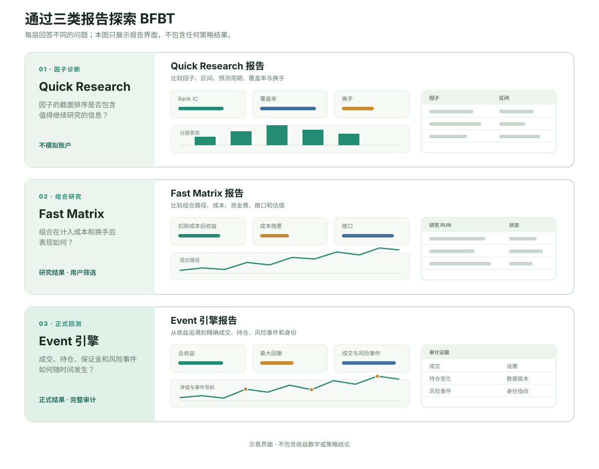

# 探索 BFBT

[English](README.md)

这是一份面向全新下载用户的自助导览，不是现场演示讲稿。BFBT 最主要的使用体验来自三层
研究流程各自产生的报告：每层回答不同问题，并保留不同深度的证据。

> BFBT 只使用公开历史市场数据，不连接交易账户，也不会执行真实订单。回测结果不构成
> 投资建议或未来收益承诺。

## 三类主要报告

| 层级 | 主要报告 | 回答的问题 |
|---|---|---|
| Quick Research | `quick_research.html` | 因子的截面排序是否包含值得继续研究的信息？ |
| Fast Matrix | `fast_matrix.html`，以及每个研究 run 的详情页 | 选定组合在换手、手续费、滑点、资金费和估值之后表现如何？ |
| Event 引擎 | `report.html`、`report.en.html` 和 `report.zh-CN.html` | 账户、仓位、成交、保证金和风险事件如何随时间发生？ |



### 1. Quick Research

研究因子时从这里开始。报告关注 Rank IC、分层收益、覆盖率和换手，不模拟账户。它适合低成本
比较候选，并尽早淘汰薄弱或不稳定的想法。

重点查看：

- 当前交易方向是否与 Rank IC 一致；
- 分层表现是否有序，而不是只靠单个分组；
- 因子在合约和时间上的覆盖是否足够；
- 换手是否高到令信号缺乏实际可行性。

### 2. Fast Matrix

只把保留的候选送入组合研究。Fast Matrix 加入目标仓位、调仓、手续费、滑点、资金费、标记
价格估值、敞口和净值。可搜索索引用于比较研究 run，每个详情页解释一组精确设置。

这些仍是研究结果，由用户决定哪些候选值得进入正式回测。

### 3. Event 引擎

Event 引擎负责正式回测，尤其适合移动止损、风险优先级、滚仓保证金或中断恢复等依赖时序状态
的策略。报告把收益和回撤连接到精确成交、持仓变化、风险事件、设置、数据版本与源码指纹。

## 推荐探索路径

1. 安装 BFBT，确认本机可以运行 `bfbt --help` 和 `bfbt doctor`。
2. 按照[入门教程](../docs/guides/beginner_tutorial.md)下载一份小型公开数据并生成第一份正式
   回测报告；不需要 API key。
3. 在浏览器中打开报告，从净值曲线选择一笔成交，再追溯到对应持仓和风险证据。
4. 按照[用户手册](../docs/guides/user_manual.md#13-fast-matrix-常规截面研究)继续体验 Quick
   Research 和 Fast Matrix。
5. 按照三类报告各自回答的问题理解它们，不要把它们当成可以互相替代的回测引擎。

用于了解入口的命令：

```bash
bfbt research list-factors
bfbt research preview --help
bfbt research matrix-run --help
bfbt research study-report --help
bfbt run --help
bfbt report --help
```

所有生成数据和报告均保存在 `data/backtest/` 下，不提交到 Git。

## 可选的已验证案例

[`r5_t4_h2_rolling_202605_202607.json`](r5_t4_h2_rolling_202605_202607.json) 定义了一个额外的
三个月证据案例。它可以验证并比较本机已经完成的三次回测，但大体积行情与 run 产物按设计不
存放在仓库里，因此它不是新用户的默认入口。

如果本机已经保存这三个精确 run，可以只读检查：

```bash
bfbt showcase inspect \
  --spec showcase/r5_t4_h2_rolling_202605_202607.json
```

也可以验证产物并生成独立中英文对比页面：

```bash
bfbt showcase prepare \
  --spec showcase/r5_t4_h2_rolling_202605_202607.json
```

生成页面位于 `data/backtest/showcases/` 下。它只是已有证据的案例视图，不能替代三层流程的
主要报告。
